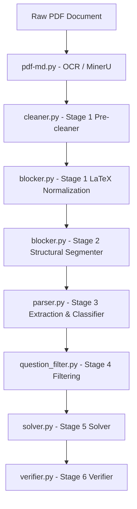

# S2 Chunking + Normalization in the Cadmus / VietAlpha Pipeline

## 1. Executive Summary

This document provides a comprehensive technical analysis of the **S2 Chunking + Normalization** stage implemented in the Cadmus / VietAlpha PDF extraction pipeline. 

### Core Function and Architecture
The S2 stage is a layout-aware structural document partitioner. Traditional chunking methods (such as fixed token-length splits or recursive regex-based separator splitting) lack semantic cohesion and fail to recognize structural document divisions, such as exercise boundaries, solutions, and answers. While semantic chunking using text embeddings improves cohesion, it is highly susceptible to corruption in mathematical documents. High-density mathematical formulas and repeating LaTeX control sequences (e.g., `\frac`, `\sum`) dominate the embedding space and artificially inflate cosine similarity, causing semantic boundary detectors to miss genuine transition points.

The pipeline resolves this through a two-stage coupled architecture:
1. **Stage 1 (LaTeX Normalization):** A destructive pre-processing step that parses the document and replaces LaTeX display and inline formulas, orphaned control sequences, and bare Unicode math glyphs with clean, typed placeholders (such as `[INLINE_FORMULA]` and `[DISPLAY_FORMULA]`). This isolates the mathematical syntax, allowing embedding models to focus on the semantic Vietnamese prose.
2. **Stage 2 (S2 Structural Segmenter):** Constructs a hybrid graph where nodes represent paragraphs (blocks) and edge weights combine normalized ordinal position distance with semantic cosine similarity. A tiered structural tagging registry matches exercise openers and terminal answers to apply edge suppression ($\sigma$). The affinity matrix is then partitioned using symmetric normalized Laplacian spectral clustering, guided by the eigengap heuristic $k^*$ and token-budget clamps.

### The Dual-View Provenance Contract
While normalization is necessary to compute clean similarity matrices, the downstream extraction stage (`parser.py`) requires the original mathematical formulas to build valid question-answer records. S2 resolves this tension through a **Dual-View Provenance Contract** implemented in `segment_stage2.py`. 

During segmentation, each `TextBlock` carries two parallel views:
- A **Normalized View** (`block.normalized_lines`): containing placeholders, used for embedding, similarity, and structural tagging.
- An **Original View** (`block.original_lines`): containing the pre-normalization source text, mapped line-by-line via Stage 1 line mappings.

During the final legacy text reconstruction, S2 uses the original view to assemble output chunks, ensuring that zero placeholders leak into downstream consumers. A strict validation guard checks the output for placeholders and raises a `RestorationAmbiguousError` if a leak occurs, aborting the write and quarantining the file.

---

## 2. Source Inventory

The following inventory details the codebase implementations, test suites, and academic papers that form the basis of this research:

| Source Type | Path or Filename | Relevance Level | Contributed Concepts / Role in Pipeline | Important Symbols / Sections |
| :--- | :--- | :--- | :--- | :--- |
| **Paper** | `S2_Chunking.pdf` (Verma, 2025) | Direct (Primary Theory) | Graph-based hybrid chunking, combining spatial proximity with semantic similarity, spectral clustering, and token-length splitting. | Abstract, Sections 3 & 4 |
| **Paper** | `science_segmentation.pdf` (Ramamonjison et al., 2023) | Direct (Primary Theory) | Entity type decomposition (Metadata Tag, Math Span, Semantic Metadata) justifying separate processing of math and prose. | Sections 4.1 & 4.2 |
| **Paper** | `Late_Chunking.pdf` (Günther et al., 2025) | Indirect | Architectural theory of contextual chunk embeddings using long-context models. | Sections 1 & 3 |
| **Paper** | `SSemb.pdf` (Li & Chen, 2025) | Indirect | Capturing joint structural (operator graphs) and semantic features of formulas for retrieval. | Abstract, Section 1 |
| **Paper** | `T-3 Model.pdf` (Arabzadeh et al., 2026) | Indirect | RAG over thinking traces; structural normalization concepts. | Abstract, Section 4 |
| **Code** | `segment_stage2.py` | Direct (Implementation) | Pure Stage 2 structural segmentation engine. Paragraph block segmentation, spatial/semantic affinity, spectral clustering, and legacy assembly. | `run_stage2`, `TextBlock`, `assemble_legacy_txt` |
| **Code** | `latex_normalize.py` | Direct (Implementation) | Pure Stage 1 LaTeX normalization engine. Executes 11-pass regex replacement and line-span alignment. | `normalize_document`, `normalize_latex`, `_derive_norm_to_orig_mapping` |
| **Code** | `structural_patterns.py` | Direct (Implementation) | Tiered structural pattern registry and regex classifiers. | `STRUCTURAL_PATTERNS`, `TIER_TO_SIGMA`, `classify_first_line` |
| **Code** | `blocker.py` | Direct (Implementation) | Stage 2 blocker CLI orchestrator. Integrates Stage 1 + Stage 2, manages ledgers, and writes output files. | `BlockerConfig`, `process_one_stage2` |
| **Code** | `cleaner.py` | Supporting | Stage 1 pre-cleaning. Strips noise, preserves blank paragraph lines, and repairs heading artifacts. | `preclean_markdown_text`, `_strip_noise_tokens_from_line` |
| **Test** | `test_stage2_restoration.py` | Direct (Verification) | Verification of the dual-view provenance contract and placeholder leakage prevention. | `test_legacy_txt_restores_original_math`, `test_assemble_refuses_without_provenance` |
| **Test** | `test_latex_normalize.py` | Direct (Verification) | Verification of Stage 1 normalization passes, delimiter counts, and line mappings. | `test_normalize_latex`, `test_multiline_collapsed_mapping` |
| **Test** | `test_cleaner_stage2_alignment.py` | Supporting | Regression test for cleaner preserving structural indicators and paragraph breaks. | `test_cleaner_preserves_blank_lines` |
| **Eval** | `run_stage2_eval.py` | Direct (Verification) | Evaluation sweep runner over sample corpus and synthetics. | `main`, `_run_once`, `_determinism_check` |

---

## 3. Pipeline Position

S2 sits as the second primary stage within the Cadmus / VietAlpha extraction pipeline.



### Inputs and Outputs
- **Input from Stage 1:** A cleaned Markdown text document (from `cleaner.py` and OCR) containing raw text, blank lines separating paragraphs, and inline/display mathematical formulas.
- **Output from S2:** 
  1. A legacy text file (`.txt`) where chunks are delimited by `---------NEW PROBLEM---------` separators.
  2. A sidecar JSON boundary register (`.boundaries.json`) containing metadata about every segment boundary, the mechanism that chose it, the pattern matched, and the clustering confidence.
- **Data Contract Before S2:** The document is represented as a single raw text string $X$.
- **Data Contract After S2:** The document is partitioned into a sequence of contiguous chunks $Y = (C_1, C_2, \dots, C_c)$, where each chunk represents a logical question-solution unit reconstructed from original lines.

### Formal Mapping
Let $X$ be the input raw Markdown string. We define S2 as the composite transformation:
$$S2: X \xrightarrow{S1} (X_{norm}, \mathcal{M}) \xrightarrow{S2_{seg}} (Y, B)$$

Where:
- $X_{norm}$ is the LaTeX-normalized text string.
- $\mathcal{M} = (L_{orig}, L_{norm}, M, \text{ambiguous})$ is the Stage 1 mapping metadata, where $L_{orig}$ is the original line list, $L_{norm}$ is the normalized line list, $M$ is the index mapping function $M(j) \subset \{0,\dots,|L_{orig}|-1\}$, and $\text{ambiguous} \in \{\text{True}, \text{False}\}$.
- $Y \in \Sigma^*$ is the output legacy text string:
  $$Y = \text{join\_with\_separators}(C_1, \dots, C_c)$$
  where each chunk $C_i$ is a sequence of original lines.
- $B = (b_1, \dots, b_k)$ is the boundary register where each $b_r$ is a `BoundaryRecord`.

### Role and Boundaries
- **Failure Mitigation:** S2 is designed to prevent over-merging adjacent exercises, over-splitting solution steps from their parent questions, and leakage of normalization placeholder tokens into the final database.
- **Explicit Non-Scope:** S2 does not parse, extract, classify, solve, or filter questions. It operates purely as a structural layout segmenter.

---

## 4. Formal Data Model

The S2 stage operates on a formal representation of lines, blocks, and boundaries:

### Alphabet and Sequences
Let $\Sigma$ be the set of Unicode characters.
- A **line** is a string $l \in \Sigma^*$.
- An **original line sequence** is $L_{orig} = (l_1, \dots, l_n)$.
- A **normalized line sequence** is $L_{norm} = (l'_1, \dots, l'_m)$ where $m \le n$ (due to newline collapse in display math environments).

### Line Mapping Function
The line mapping function $M: \{0, \dots, m-1\} \to \mathcal{P}(\{0, \dots, n-1\})$ maps each normalized line index $j$ to the set of original line indices that collapsed into it. If no collapse occurred at line $j$, $M(j) = \{j\}$.

### Text Block (Graph Node)
A text block (paragraph-level unit) $B_i$ is defined as the tuple:
$$B_i = (\text{pos}_i, s_i, e_i, t_i, L_{norm, i}, L_{orig, i}, s'_{orig, i}, e'_{orig, i}, \text{has\_original}_i)$$
Where:
- $\text{pos}_i = i$ is the 0-indexed position in the document block sequence.
- $s_i, e_i$ are the start and end (exclusive) line indices in $L_{norm}$.
- $t_i \in \Sigma^*$ is the normalized text representation (stripped and joined with spaces).
- $L_{norm, i} = (l'_{s_i}, \dots, l'_{e_i-1})$ is the tuple of normalized lines.
- $L_{orig, i} = (l_{s'_{orig, i}}, \dots, l_{e'_{orig, i}-1})$ is the tuple of original lines.
- $s'_{orig, i} = \min(\bigcup_{j=s_i}^{e_i-1} M(j))$ is the starting original line index.
- $e'_{orig, i} = \max(\bigcup_{j=s_i}^{e_i-1} M(j)) + 1$ is the ending original line index.
- $\text{has\_original}_i \in \{\text{True}, \text{False}\}$ is a boolean indicating the presence of valid original-line provenance.

### Structural Tag
A structural tag $T_i$ for block $B_i$ is defined as:
$$T_i = (\text{tier}_i, \text{label}_i, \sigma_i, \text{kind}_i)$$
Where:
- $\text{tier}_i \in \{\text{"hard"}, \text{"medium"}, \text{"soft"}, \text{None}\}$.
- $\text{label}_i \in \{\text{"md\_heading"}, \text{"example\_label"}, \text{"exercise\_label"}, \text{"exercise\_decimal"}, \text{"answer\_terminal"}, \text{"numbered\_item"}, \text{"bold\_label"}, \text{"solution\_opener"}, \text{None}\}$.
- $\sigma_i \in \{10^{-6}, 0.1, 0.3, 1.0\}$ is the suppression coefficient.
- $\text{kind}_i \in \{\text{"start"}, \text{"terminal"}, \text{"internal"}, \text{None}\}$.

### Boundary Record
A boundary record $b_r$ is defined as:
$$b_r = (\text{block\_index}, \text{line\_start}, \text{mechanism}, \text{pattern\_label}, \sigma, \text{confidence})$$
Where:
- $\text{mechanism} \in \{\text{"hard\_structural"}, \text{"medium\_structural"}, \text{"soft\_structural"}, \text{"spectral"}\}$.
- $\text{confidence} \in \{\text{"high"}, \text{"medium"}, \text{"low"}\}$.

---

## 5. S2 Chunking Mechanism

The complete chunking algorithm runs through the following sequence:

### 1. Block Segmentation
The normalized document is split into paragraph blocks at blank lines ($l'.strip() == ""$), as implemented in `_segment_into_blocks` (`segment_stage2.py:L145`). Each block aggregates its normalized line slice and maps back to its original line slice using the $norm\_to\_orig$ index map.

### 2. Structural Tagging
The first non-empty line of each block (and optionally its lookahead line) is matched against the regex registry in `structural_patterns.py` (`structural_patterns.py:L34`). The block is assigned a `StructuralTag` containing its tier, pattern label, suppression coefficient $\sigma$, and kind.

### 3. Spatial Weight Matrix
The spatial proximity matrix $W_{spatial} \in \mathbb{R}^{N \times N}$ is constructed by computing the normalized ordinal distance between blocks $i$ and $j$, as implemented in `_build_spatial_matrix` (`segment_stage2.py:L257`):
$$d_{ord}(i, j) = \frac{|i - j|}{N}$$
$$w_{pos}(i, j) = \frac{1}{1 + d_{ord}(i, j)}$$
$$w_{pos}(i, i) = 0.0$$

Structural prior suppression is then applied to adjacent edges ($|i - j| = 1$):
- If $T_i.\text{kind} == \text{"terminal"}$ (e.g., `Đáp án:` terminal markers):
  $$w_{spatial}(i, i+1) = \sigma_i \times w_{pos}(i, i+1)$$
  $$w_{spatial}(i+1, i) = \sigma_i \times w_{pos}(i+1, i)$$
- Else ($T_i.\text{kind} \in \{\text{"start"}, \text{"internal"}\}$, e.g. headings, example openers, numbered items):
  $$w_{spatial}(i-1, i) = \sigma_i \times w_{pos}(i-1, i)$$
  $$w_{spatial}(i, i-1) = \sigma_i \times w_{pos}(i, i-1)$$

### 4. Semantic Weight Matrix
Blocks are embedded using the SiliconFlow `Qwen/Qwen3-Embedding-4B` model in batches, as implemented in `_build_semantic_matrix` (`segment_stage2.py:L320`). Let $\mathbf{v}_i \in \mathbb{R}^{2560}$ be the embedding vector for block $B_i$. The vectors are L2-normalized:
$$\hat{\mathbf{v}}_i = \frac{\mathbf{v}_i}{\|\mathbf{v}_i\|_2}$$
The semantic weight matrix $W_{semantic}$ is computed as:
$$W_{semantic}[i, j] = \hat{\mathbf{v}}_i \cdot \hat{\mathbf{v}}_j$$
The values are clipped to $[-1.0, 1.0]$.

### 5. Combined Weight and Affinity Matrix
The combined weight matrix $W_{combined}$ is the elementwise average of the spatial and semantic weights:
$$W_{combined} = \frac{W_{spatial} + W_{semantic}}{2.0}$$
The affinity matrix $A$ is derived by setting the diagonal to zero and clipping negative values:
$$A_{ij} = \max(W_{combined}[i, j], 0) \quad \forall i \ne j$$
$$A_{ii} = 0.0$$
Symmetry is explicitly guarded: $A = 0.5 \times (A + A^T)$. If $N \ge 200$, edges with $A_{ij} < \tau_{sparse} = 0.2$ are set to zero, and the matrix is converted to a compressed sparse row (CSR) format, as implemented in `_build_affinity_matrix` (`segment_stage2.py:L361`).

### 6. Spectral Partitioning
Let $D$ be the diagonal degree matrix where $D_{ii} = \sum_{j} A_{ij}$. The symmetric normalized Laplacian $L_{sym}$ is computed as:
$$L_{sym} = I - D^{-1/2} A D^{-1/2}$$
We compute the $k_{max}$ smallest eigenvalues and corresponding eigenvectors:
$$L_{sym} U = U \Lambda$$
Where:
- $k_{max} = \min(N-1, \max(2, \text{total\_tokens} // \text{min\_tokens}))$.
- $\Lambda = \operatorname{diag}(\lambda_1, \dots, \lambda_{k_{max}})$ with sorted eigenvalues $\lambda_1 \le \lambda_2 \le \dots \le \lambda_{k_{max}}$.
- $U \in \mathbb{R}^{N \times k_{max}}$ is the eigenvector matrix.

### 7. Eigengap Estimation and Clamping
The optimal number of clusters $k^*$ is estimated using the eigengap heuristic starting from index 1 (corresponding to $\lambda_2 \to \lambda_3$ jump):
$$k^* = \operatorname{argmax}_{k \ge 2} (\lambda_{k+1} - \lambda_k)$$
To guarantee that the cluster sizes respect the token constraints, $k^*$ is clamped:
$$k_{min} = \max\left(1, \frac{\text{total\_tokens}}{\text{max\_tokens}}\right)$$
$$k_{max\_tok} = \max\left(1, \frac{\text{total\_tokens}}{\text{min\_tokens}}\right)$$
$$k^* \leftarrow \max(k_{min}, \min(k^*, k_{max\_tok}, k_{max}))$$

### 8. KMeans Clustering
The row-normalized matrix of the bottom $k^*$ eigenvectors $U_{norm} \in \mathbb{R}^{N \times k^*}$ is clustered:
$$U_{norm}[i, :] = \frac{U[i, 1 \dots k^*]}{\|U[i, 1 \dots k^*]\|_2}$$
We run KMeans with $k^*$ clusters on $U_{norm}$ to assign a label $y_i \in \{0, \dots, k^*-1\}$ to each block. Contiguous segments are extracted by marking a boundary at block index $i$ if $y_i \ne y_{i-1}$, as implemented in `_cluster_and_extract_boundaries` (`segment_stage2.py:L461`).

### 9. Structural Reconciliation
Spectral boundaries are combined with structural boundaries. For each block $i$, if $T_i.\text{tier} == \text{"hard"}$:
- If $T_i.\text{kind} == \text{"terminal"}$, we force a boundary at $i+1$.
- Else, we force a boundary at $i$.
Under `force_hard_only=False`, medium structural boundaries are also forced.

### 10. Token-Length Enforcement
Contiguous segments are evaluated. If a segment contains $> \text{max\_tokens}$ and has $\ge 4$ blocks, it is recursively partitioned once using spectral clustering with $k^*=2$, as implemented in `_enforce_token_limits` (`segment_stage2.py:L530`).

---

## 6. S2 Normalization Mechanism

Normalization is a deterministic, ordered 11-pass regex replacement pipeline designed to prevent LaTeX symbols and delimiters from corrupting semantic embeddings.

The normalization function is defined as:
$$\mathcal{N} = r_{10} \circ r_9 \circ \dots \circ r_0$$

The concrete rules $r_i$ implemented in `latex_normalize.py` (`latex_normalize.py:L149`) are:

### Pass 0: Protect Escaped Dollars ($r_0$)
- **Purpose:** Protects literal dollar signs (`\$`) so they are not matched as formula delimiters in later passes.
- **Input Pattern:** `r"\$"`
- **Replacement:** `DOLLAR_SENTINEL` (`\x00ESCAPED_DOLLAR\x00`)
- **Lossiness:** Lossless.
- **Math Semantic Value:** Critical. Prevents currency text or literal dollar symbols from breaking the delimiter matching logic.

### Pass 1: Named Display Environments ($r_1$)
- **Purpose:** Identifies and replaces LaTeX multiline display math environments.
- **Input Pattern:** `\\begin{(equation\*?|align\*?|aligned|gather\*?|multline\*?|eqnarray\*?|cases|array|matrix|pmatrix|bmatrix|vmatrix)\}.*?\\end{\1}` (with `re.DOTALL`)
- **Replacement:** `[DISPLAY_FORMULA]`
- **Lossiness:** Lossy (formula content is replaced, but structure is preserved).
- **Example:** `\begin{align} x &= 1 \\ y &= 2 \end{align}` $\rightarrow$ `[DISPLAY_FORMULA]`
- **Math Semantic Value:** Prevents complex multi-line math alignments from generating massive lists of noisy subwords.

### Pass 2: Bracket Display Math ($r_2$)
- **Purpose:** Normalizes display equations wrapped in `\[...\]`.
- **Input Pattern:** `\\\[.*?\\\]` (with `re.DOTALL`)
- **Replacement:** `[DISPLAY_FORMULA]`
- **Lossiness:** Lossy.
- **Example:** `\[f(x) = \sin x\]` $\rightarrow$ `[DISPLAY_FORMULA]`

### Pass 3: Parenthesis Inline Math ($r_3$)
- **Purpose:** Normalizes inline equations wrapped in `\(...\)`.
- **Input Pattern:** `\\\(.*?\\\)` (with `re.DOTALL`)
- **Replacement:** `[INLINE_FORMULA]`
- **Lossiness:** Lossy.
- **Example:** `\(x + 1\)` $\rightarrow$ `[INLINE_FORMULA]`

### Pass 4: Double Dollar Display Math ($r_4$)
- **Purpose:** Normalizes display math wrapped in `$$...$$`.
- **Input Pattern:** `\$\$[\s\S]*?\$\$` (or `\$\$[^\n]*?\$\$` if the document has an odd count of `$$` tokens).
- **Replacement:** `[DISPLAY_FORMULA]`
- **Lossiness:** Lossy.
- **Example:** `$$x^2 + y^2 = 1$$` $\rightarrow$ `[DISPLAY_FORMULA]`
- **Math Semantic Value:** The newline-bounded fallback prevents an unmatched display delimiter from pairing across the document and swallowing large spans of prose.

### Pass 5: Single Dollar Inline Math ($r_5$)
- **Purpose:** Normalizes inline formulas wrapped in `$...$`.
- **Input Pattern:** `\$[^$\n]+?\$` (lazy quantifier)
- **Replacement:** `[INLINE_FORMULA]`
- **Lossiness:** Lossy.
- **Example:** `$a \in B$` $\rightarrow$ `[INLINE_FORMULA]`
- **Math Semantic Value:** The negated character class `[^$\n]` prevents the match from spanning newlines or merging adjacent inline formulas on the same line.

### Pass 6: Residual LaTeX Control Sequences ($r_6$)
- **Purpose:** Captures orphaned control sequences that escaped delimiters due to OCR defects.
- **Input Pattern:** `\\[a-zA-Z]+(?:\{[^}]*\}){0,2}`
- **Replacement:** `[RESIDUAL_FORMULA]`
- **Lossiness:** Lossy.
- **Example:** `\sqrt{2}` $\rightarrow$ `[RESIDUAL_FORMULA]`
- **Math Semantic Value:** Protects the embedding model from seeing standalone LaTeX keywords.

### Pass 7: Bare Unicode Math Glyphs ($r_7$)
- **Purpose:** Collapses literal Unicode math symbols and Greek letters that survived OCR.
- **Input Pattern:** Consecutive runs of characters in `"∫∑∏√∞≤≥≠≈∈∉...πθφψ..."`
- **Replacement:** `[UNICODE_MATH]`
- **Lossiness:** Lossy.
- **Example:** `x ≥ 0` $\rightarrow$ `x [UNICODE_MATH] 0`

### Pass 8: Restore Escaped Dollars ($r_8$)
- **Purpose:** Restores protected literal dollar signs.
- **Replacement:** Replaces `DOLLAR_SENTINEL` back to `$` (literal).
- **Lossiness:** Lossless.

### Pass 9: Whitespace Tidy ($r_9$)
- **Purpose:** Ensures exactly one space exists on each side of every placeholder token, preventing tokenization fusion.
- **Input Pattern:** `[ \t]*(placeholder)[ \t]*`
- **Replacement:** ` \1 `
- **Lossiness:** Lossless.

### Pass 10: Space Collapse ($r_{10}$)
- **Purpose:** Collapses multiple spaces and strips trailing line spaces.
- **Lossiness:** Lossless.

---

## 7. Interaction Between Chunking and Normalization

Normalization occurs **before** block segmentation and chunking. This ordering is non-commutative:

$$\text{Chunk}(\mathcal{N}(L)) \neq \mathcal{N}(\text{Chunk}(L))$$

### Non-Commutativity and Structural Preservation
If the document were split into text blocks first, display math environments that span across multiple lines (and contain blank lines) would be broken into separate blocks. The regex patterns for named display environments ($r_1$) or display brackets ($r_2$) would fail to match across block boundaries, resulting in unnormalized LaTeX syntax reaching the embedding stage.

By running normalization at the document level before block segmentation:
1. Multi-line display environments are successfully collapsed into a single `[DISPLAY_FORMULA]` placeholder line.
2. The block segmenter sees a flattened, clean layout.
3. The embedding model clusters blocks based on Vietnamese prose rather than formula complexity.

### Structural vs. Semantic Alignment
The dual-view provenance contract ensures that while the clustering algorithm operates on the normalized text, the final legacy output is reconstructed from the original text:

```
[Input Text L] ---> [Stage 1 Normalization] ---> [Normalized Text L_norm]
      |                                                  |
      | (Mapped line-by-line via M)                       | (Clustering / Tags)
      v                                                  v
[Original block lines] <--- [Dual-View Contract] <--- [S2 Segmentation]
      |
      v
[Restored legacy.txt]
```

This prevents the loss of mathematical notation in the final output while maintaining the clustering performance of the normalized view.

---

## 8. Mathematical Content Preservation

Preserving mathematical content is a critical requirement of the S2 stage. The implementation in `segment_stage2.py` guarantees this through strict invariants:

### Mathematical Invariance
Let $m$ be a mathematical expression located within a raw text line $l$. Under the dual-view contract, the text block $B_i$ contains the exact original text of the line:
$$\text{original\_lines}(B_i) = l$$
Therefore, the restoration function is invariant:
$$\text{meaning}(m) = \text{meaning}(\text{Restore}(\mathcal{N}(m)))$$

### Semantic Protection Rules
- **No Regex-Based Reconstruction:** S2 does not attempt to reverse-engineer or replace placeholder tokens in the normalized text using regex patterns. This would be highly error-prone. Instead, it directly maps back to the raw source lines.
- **Placeholder Leakage Guard:** Every call to `assemble_legacy_txt` (`segment_stage2.py:L972`) running in `source="original"` mode triggers `assert_no_placeholders_in_final_output` (`segment_stage2.py:L955`). If any placeholder (e.g., `[INLINE_FORMULA]`) is found in the final reconstructed text, a `RestorationAmbiguousError` is raised. This prevents corrupted records from escaping into downstream stages.

---

## 9. Algorithmic Invariants

The S2 chunking algorithm maintains several strict invariants to ensure structural and data integrity:

### 1. Reading Order Invariant
The original sequence and reading order of the document blocks are strictly preserved. The line starts of subsequent blocks must be monotonically increasing:
$$\forall i < j, \quad \text{line\_start}(B_i) < \text{line\_start}(B_j)$$

### 2. Partition Invariant
The generated chunks $C_1, \dots, C_c$ form a strict partition of the set of text blocks $\{B_0, \dots, B_{N-1}\}$:
$$\bigcup_{p=1}^c C_p = \{B_0, \dots, B_{N-1}\} \quad \text{and} \quad C_p \cap C_q = \emptyset \quad \forall p \neq q$$
No text block is duplicated or omitted.

### 3. Hard Structural Coverage Invariant
All block boundaries marked as `hard` structural priors (e.g., `##`, `Ví dụ N`, `Đáp án:`) must be covered by the final chunk boundaries. If block $i$ is a hard boundary opener:
$$i \in \text{final\_boundaries}$$
If block $i$ is a hard terminal boundary (e.g., `Đáp án:`):
$$i+1 \in \text{final\_boundaries} \quad (\text{if } i+1 < N)$$
This invariant is formally validated via:
$$\text{stage2\_pass} = \text{required\_boundaries} \subseteq \text{final\_boundaries}$$

### 4. Placeholder Isolation Invariant
The final assembled legacy text $Y$ contains zero instances of the placeholder tokens:
$$\forall ph \in \{[INLINE\_FORMULA], [DISPLAY\_FORMULA], [RESIDUAL\_FORMULA], [UNICODE\_MATH]\}, \quad ph \notin Y$$

---

## 10. Error Model and Failure Modes

The S2 stage faces several potential failure modes due to OCR noise and document formatting:

| Failure Mode | Root Cause | Pipeline Position | Current Mitigation | Remaining Risk |
| :--- | :--- | :--- | :--- | :--- |
| **Mismatched Display Delimiters** | OCR fails to extract matching `$$` tokens, causing an odd count in the document. | Stage 1 Delimiter Passes | Fallback to line-local pattern `PATTERN_DOUBLE_DOLLAR_LINE` if the double-dollar count is odd. | Low (orphaned `$$` are left literal instead of collapsing large spans). |
| **Mapping Ambiguity** | Severe OCR damage or line splits prevent Stage 1 from aligning normalized lines back to original lines. | Stage 1 Line Alignment | `_derive_norm_to_orig_mapping` sets `mapping_ambiguous=True`. In strict mode, `blocker.py` quarantines the file. | Medium (causes documents to be quarantined, requiring manual fix). |
| **OCR Section Sign Misreads** | MinerU misreads the section sign `§` as `$`, producing headings like `### $1`. | Stage 1 Pre-cleaner | Scoped regex repair in `cleaner.py`: `re.sub(r'^(#{1,6}\s+)\$(\d+)\$?(?=\s|$)', r'\1\2', line)`. | Low (successfully repaired). |
| **HTML Table Boilerplate** | Table cell styling and attributes dominate block embeddings. | Stage 1 Pre-cleaner | `cleaner.py` strips attributes from HTML table tags, collapsing them to bare `<td>`, `<tr>`, etc. | Low. |
| **Standalone Figure Labels** | Standalone "Hình x.y" lines disrupt spectral clustering. | Stage 1 Pre-cleaner | Cleaned and removed in `cleaner.py` via matching Figure label regexes. | Low. |
| **False Splits on Solutions** | Spectral clustering separates the explanation (`Giải`) into a new problem. | Stage 2 Reconciliation | `default_is_question_start` glues `solution_opener` (`Giải`) and spectral cuts back to the parent question. | Low (only question openers in `QUESTION_OPENER_LABELS` emit legacy separators). |

---

## 11. Code Walkthrough

This section details the primary modules involved in the S2 stage:

### 1. `latex_normalize.py`
- **Role:** Implements the Stage 1 LaTeX normalization.
- **Key Functions:**
  - `normalize_latex` (L149-301): Implements the 11-pass regex replacement pipeline.
  - `_derive_norm_to_orig_mapping` (L309-411): Derives the index mapping $M$ between normalized and original lines by walking the lines in lockstep and verifying spans.
  - `normalize_document` (L414-520): Main entry point returning `DocumentNormalizationResult`.
  - `verify_normalization` (L523-608): Runs validation checks (asserting placeholder count matches and no unexplained dollars remain).

### 2. `segment_stage2.py`
- **Role:** Pure Stage 2 structural segmentation engine.
- **Key Functions:**
  - `_segment_into_blocks` (L145-220): Splits normalized text at blank lines, assigning original lines via the line mapping.
  - `_build_spatial_matrix` (L257-292): Computes normalized ordinal distances and applies structural suppression ($\sigma$) to adjacent edges.
  - `_build_semantic_matrix` (L320-355): Batch encodes block text via SiliconFlow and computes cosine similarities.
  - `_build_affinity_matrix` (L361-382): Combines spatial and semantic weights, zeroing the diagonal and clipping negatives.
  - `_compute_laplacian_eigenvectors` (L389-427): Computes symmetric normalized Laplacian $L_{sym}$ and extracts bottom eigenvectors.
  - `_estimate_k_star` (L433-454): Heuristically determines $k^*$ from the eigengap, constrained by token budget clamps.
  - `_reconcile_with_structural_priors` (L490-515): Forces hard/medium structural boundaries into the boundary list.
  - `assemble_legacy_txt` (L972-1076): Reconstructs the legacy text string, restoring original lines and enforcing placeholder leakage guards.

### 3. `structural_patterns.py`
- **Role:** Registers structural regex patterns and classifies first lines of blocks.
- **Key Symbols:**
  - `STRUCTURAL_PATTERNS` (L34-50): Lists compiled regexes for headings, exercises, decimal numbers, answers, lists, and solutions.
  - `classify_first_line` (L61-88): Matches a block's first line (and lookahead line) against the registry.

### 4. `blocker.py`
- **Role:** Command line interface orchestrator.
- **Key Functions:**
  - `process_one_stage2` (L145-348): Orchestrates Stage 1 and Stage 2, catching `RestorationAmbiguousError` and writing output files.

---

## 12. Paper-to-Code Mapping

The following table maps the mechanisms described in the academic papers to their concrete implementation in the codebase:

| Academic Paper | Mechanism / Concept | Paper Quote or Claim | Implemented Location | Match Level | Notes / Engineering Adaptation |
| :--- | :--- | :--- | :--- | :--- | :--- |
| **Verma (2025)** | Combined Graph Weights | $w_{combined}(i, j) = \frac{w_{spatial}(i, j) + w_{semantic}(i, j)}{2}$ | `_build_affinity_matrix` (`segment_stage2.py:L373`) | **Exact** | Matches the paper's equal-weight average formula. |
| **Verma (2025)** | Spatial Bounding Box Distance | $w_{spatial}(i, j) = \frac{1}{1 + d(i, j)}$ where $d$ is Euclidean centroid distance. | `_build_spatial_matrix` (`segment_stage2.py:L268`) | **Adapted** | Modified to use **normalized ordinal distance** in the block sequence ($d_{ord} = \frac{|i-j|}{N}$) because bounding box coordinates are unavailable in parsed Markdown. |
| **Verma (2025)** | Spectral Clustering and Laplacian | "We use spectral clustering to partition the graph... derived from combined weights." | `_compute_laplacian_eigenvectors` (`segment_stage2.py:L405-424`) | **Exact** | Computes the symmetric normalized Laplacian $L_{sym}$ and extracts bottom eigenvectors. |
| **Verma (2025)** | Token-Length Split | `SplitClustersByTokenLength(Clusters, MaxTokenLength)` | `_enforce_token_limits` (`segment_stage2.py:L530`) | **Exact** | Recursively applies spectral clustering with $k^*=2$ to split oversized segments. |
| **Ramamonjison et al. (2023)** | Entity Decomposition | "sentences... likely to have both text and mathematical content... symbol tokenizer... to alleviate SciBERT's tokenizer limitations." | `latex_normalize.py` (`latex_normalize.py:L149`) | **Adapted** | Renders math spans into placeholders (`[INLINE_FORMULA]`) before embedding, matching the paper's logic of isolating math from prose. |
| **Ramamonjison et al. (2023)** | Math Parser / Translation | Routes math content to a semantic parse tree and prose to SciBERT. | `parser.py` / `solver.py` | **Adapted** | Downstream stages (`parser.py` and `solver.py`) consume the reconstructed original text to perform LLM-based parsing and solving. |

---

## 13. Complexity Analysis

The asymptotic complexity of the S2 stage is analyzed below:

### Variables
- $N$: number of paragraph blocks ($N \le 800$ enforced by the parser).
- $L$: number of lines in the document.
- $R$: number of regex normalization rules ($R = 11$).
- $D$: embedding vector dimension ($D = 2560$).
- $K$: number of spectral clusters ($K = k^*$).
- $I$: number of KMeans iterations (default $I = 300$).

### Time Complexity
1. **LaTeX Normalization (Stage 1):** 
   Applying $R$ regex patterns over $L$ lines is $O(L \cdot R \cdot \operatorname{len}(l))$. The greedy span alignment in `_derive_norm_to_orig_mapping` runs in $O(L \cdot \text{max\_span})$ where $\text{max\_span} \le 52$. Thus, Stage 1 runs in $O(L)$ linear time.
2. **Semantic Weight Matrix:**
   Embedding $N$ blocks with a model of dimension $D$ is $O(N \cdot D)$ for vector generation, plus $O(N^2 \cdot D)$ matrix dot-products for cosine similarity.
3. **Spatial Weight Matrix:**
   Computing pairwise ordinal distances and checking tags is $O(N^2)$ time.
4. **Laplacian Eigendecomposition:**
   - Dense: $O(N^3)$ using standard solver `np.linalg.eigh`.
   - Sparse: $O(N \cdot k_{max}^2)$ using `scipy.sparse.linalg.eigsh`.
5. **KMeans Clustering:**
   Clustering $N$ row vectors in $K$-dimensional space is $O(N \cdot K \cdot I \cdot d_E)$ where $d_E = K$. Since $K \le 40$ in typical math textbooks, this is extremely fast.
6. **Legacy Assembly:**
   Walking and joining lines is $O(L)$ time.

**Total Time Complexity:**
$$\mathcal{T}_{total} \approx O(L + N^2 \cdot D + N^3)$$
Since $N$ is capped at 800, the cubic eigendecomposition cost is strictly bounded, executing in less than 1 second per document. The dominating factor is the $O(N \cdot D)$ embedding inference call, which is batch-processed.

### Space Complexity
1. **Weight & Affinity Matrices:**
   Pairwise matrices ($W_{spatial}$, $W_{semantic}$, $A$) require $O(N^2)$ space. For $N=800$, a float64 dense matrix consumes $800 \times 800 \times 8$ bytes $\approx 5.12$ MB, which is negligible.
2. **Eigenvector Matrix:**
   $U \in \mathbb{R}^{N \times k_{max}}$ requires $O(N \cdot k_{max})$ space.

**Total Space Complexity:**
$$\mathcal{S}_{total} \approx O(N^2 + L)$$
The memory footprint is extremely light and scales linearly with document length $L$ and quadratically with block count $N$.

---

## 14. Examples and Traces

This section presents a tracing example derived from the synthetic unit tests in `tests/test_stage2_restoration.py` to illustrate the dual-view mapping and math preservation.

### 1. Raw Input Document ($L_{orig}$)
```markdown
# Bài tập

Ví dụ 1) Tìm nguyên hàm của $f(x) = 2x$.

Giải

Ta có $\int 2x\,dx = x^2 + C$.

Đáp án: $x^2 + C$.
```

### 2. Normalized Document ($L_{norm}$)
```markdown
# Bài tập

Ví dụ 1) Tìm nguyên hàm của [INLINE_FORMULA] .

Giải

Ta có [INLINE_FORMULA] .

Đáp án: [INLINE_FORMULA] .
```

### 3. Block Segmentation & Tagging
The block segmenter splits the normalized text at blank lines, yielding the following blocks:

- **Block 0 (Heading):**
  - Normalized: `# Bài tập`
  - Tag: `(tier="hard", label="md_heading", sigma=1e-6, kind="start")`
- **Block 1 (Opener):**
  - Normalized: `Ví dụ 1) Tìm nguyên hàm của [INLINE_FORMULA] .`
  - Original: `Ví dụ 1) Tìm nguyên hàm của $f(x) = 2x$.`
  - Tag: `(tier="hard", label="example_label", sigma=1e-6, kind="start")`
- **Block 2 (Solution):**
  - Normalized: `Giải`
  - Original: `Giải`
  - Tag: `(tier="soft", label="solution_opener", sigma=0.3, kind="internal")`
- **Block 3 (Prose):**
  - Normalized: `Ta có [INLINE_FORMULA] .`
  - Original: `Ta có $\int 2x\,dx = x^2 + C$.`
  - Tag: `(None, None, 1.0, None)`
- **Block 4 (Terminal):**
  - Normalized: `Đáp án: [INLINE_FORMULA] .`
  - Original: `Đáp án: $x^2 + C$.`
  - Tag: `(tier="hard", label="answer_terminal", sigma=1e-6, kind="terminal")`

### 4. Boundary Register Output
During spectral clustering and structural reconciliation:
- Block 0 matches heading opener $\rightarrow$ Forced Boundary at 0 (`hard_structural`).
- Block 1 matches `Ví dụ` opener $\rightarrow$ Forced Boundary at 1 (`hard_structural`).
- Block 4 matches `Đáp án:` terminal $\rightarrow$ Forced Boundary at 5 (outgoing edge, `hard_structural`).

The resulting boundary register is:
```json
{
  "document_id": "synthetic_example",
  "n_blocks": 5,
  "n_clusters_estimated": 2,
  "boundaries": [
    {
      "block_index": 0,
      "line_start": 0,
      "mechanism": "hard_structural",
      "pattern_label": "md_heading",
      "sigma_value": 1e-06,
      "confidence": "high"
    },
    {
      "block_index": 1,
      "line_start": 2,
      "mechanism": "hard_structural",
      "pattern_label": "example_label",
      "sigma_value": 1e-06,
      "confidence": "high"
    }
  ]
}
```

### 5. Assembled Legacy Text
When `assemble_legacy_txt` runs with `source="original"`, it walks the segment boundaries:
- Segment 0 (Block 0): `# Bài tập`
- Segment 1 (Blocks 1 to 4): `Ví dụ 1) Tìm nguyên hàm của $f(x) = 2x$.`, `Giải`, `Ta có $\int 2x\,dx = x^2 + C$.`, and `Đáp án: $x^2 + C$.`.
- Only Block 1 satisfies `default_is_question_start` (its label `example_label` is in `QUESTION_OPENER_LABELS`). Block 0 is a heading and starts the file. The boundary at 5 has no blocks after it.
- Block 2 (`solution_opener` / `Giải`) and Block 4 (`answer_terminal` / `Đáp án:`) do **not** trigger question starts, so they are glued silently to Segment 1 using blank lines.

The final output legacy text is:
```markdown
# Bài tập

---------NEW PROBLEM---------
Ví dụ 1) Tìm nguyên hàm của $f(x) = 2x$.

Giải

Ta có $\int 2x\,dx = x^2 + C$.

Đáp án: $x^2 + C$.
```
The original LaTeX math is fully restored, and all placeholders are completely eliminated.

---

## 15. Validation and Tests

The S2 stage is covered by a comprehensive regression and validation test suite.

### Unit Tests
- **`test_latex_normalize.py`:** Verifies Stage 1 LaTeX normalization passes, delimiter counts, Unicode symbol collapsing, and line mappings.
- **`test_stage2_restoration.py`:** Verifies the dual-view provenance contract, original math restoration, and placeholder leakage rejection.
- **`test_cleaner_stage2_alignment.py`:** Ensures `cleaner.py` preserves paragraph blank lines and structural headers for the Stage 2 segmenter.
- **`test_config_restoration_wiring.py`:** Tests configuration wiring for Stage 1 / Stage 2 restoration flags.

### Sweep Evals
The eval script `run_stage2_eval.py` executes a bounded configuration sweep over 5 configurations (`default`, `conservative`, `aggressive`, `balanced`, and `structural_lean`) against sample documents and synthetic fixtures. It asserts:
- Zero hard failures during segmentation and legacy text assembly.
- Zero placeholder leakage.
- Exact determinism across consecutive runs (verified by hashing output data payloads).

### Command to Run Validation
To run the S2 test suite, execute the following command:
```powershell
python -m pytest tests/test_latex_normalize.py tests/test_stage2_restoration.py tests/test_config_restoration_wiring.py tests/test_cleaner_stage2_alignment.py -v
```

---

## 16. Implementation Gaps and Recommendations

The following gaps and recommendations have been identified during codebase investigation:

1. **Embedding Model Discrepancy:**
   - **Observation:** `blocker.py` CLI default specifies `Qwen/Qwen3-Embedding-4B` with dimension 2560 (`blocker.py:L68-69`), whereas `tasks/segment_enhancement_v1/vietalpha_stage2_structural_segmentation.md` recommends `BAAI/bge-m3` (`vietalpha_stage2_structural_segmentation.md:L274`).
   - **Recommendation:** Unify the configuration defaults across the codebase and documentation to prevent runtime failures if a model is swapped without updating the expected dimensions.
2. **Anomalous Document Length Pre-splitting:**
   - **Observation:** Document block counts $N \ge 800$ are flagged as anomalous in `vietalpha_stage2_structural_segmentation.md` (`vietalpha_stage2_structural_segmentation.md:L112`), recommending pre-splitting by Markdown headings. However, this pre-splitting is not implemented in `segment_stage2.py`. Very long documents will attempt dense spectral clustering, incurring cubic latency $O(N^3)$.
   - **Recommendation:** Implement a pre-splitting gateway in `blocker.py` that partitions documents at major Markdown headings (`#` or `##`) before running Stage 2.
3. **Table Multi-Line Alignment:**
   - **Observation:** `cleaner.py` strips attributes from HTML tables, keeping cell content, which is excellent. However, if table cells contain complex formulas that span multiple lines, the line mapping can become ambiguous during normalization.
   - **Recommendation:** Enhance `cleaner.py` to flatten multi-line table cells into single-line cells prior to Stage 1 normalization.

---

## 17. Glossary

- **S2 Chunking:** A graph-based hybrid document chunking framework integrating spatial-adapted distance, structural prior tagging, and semantic block embeddings, partitioned via spectral clustering.
- **LaTeX Normalization:** An ordered multi-pass text pre-processing stage replacing math formulas with typed placeholder tokens to isolate prose semantics.
- **Affinity Matrix:** A symmetric non-negative matrix representing the edge weights (similarity) between all pairs of nodes in a graph.
- **Laplacian Matrix:** A matrix representation of a graph, defined as $L = D - A$, where $D$ is the degree matrix and $A$ is the affinity matrix.
- **Eigengap Heuristic:** A spectral analysis method for identifying the optimal number of clusters by finding the largest difference between consecutive eigenvalues of the graph Laplacian.
- **Dual-View Provenance Contract:** A pipeline contract ensuring that text blocks carry both a normalized view (for clustering) and an original view (for final output reconstruction).
- **Placeholder Leakage:** An error condition where normalization tokens (e.g. `[INLINE_FORMULA]`) leak into the final database, corrupting the records.
- **Structural Suppression:** The reduction of spatial edge weights in the document graph at transitions that match known structural boundaries, forcing the spectral clustering to place boundaries at those points.

---

## 18. Appendix A - Source Quotes

### From `S2_Chunking.pdf` (Verma, 2025):
- **Graph construction:**
  > "By leveraging bounding box information (bbox) and text embeddings, our method constructs a weighted graph representation of document elements, which is then clustered using spectral clustering." (Abstract, Page 1)
- **Spectral suitability:**
  > "Spectral clustering is particularly suitable for this task because it can handle complex relationships and nonlinear structures in the graph." (Section 3.3, Page 5)

### From `science_segmentation.pdf` (Ramamonjison et al., 2023):
- **Symbol Tokenizer:**
  > "...equipped with a rule-based symbol tokenizer proposed in Lee and Na (2022) to alleviate the limitation of SciBERT's tokenizer in detecting the boundaries of mathematical symbols." (Section 4.1, Page 4)

### From `segment_stage2.py` comments:
- **Restoration Guard:**
  > "The placeholder guard assert_no_placeholders_in_final_output detects a normalized token ([INLINE_FORMULA] &c.) in what was supposed to be original-source output. This catches bugs in the Stage 1 mapping, copy-paste regressions in Stage 2, or any future leak path that bypasses the dual-view contract." (L947-951)

---

## 19. Appendix B - Open Questions

1. **Offline Evaluation Embeddings:**
   - **Question:** Is there a planned transition to run the local eval harness (`run_stage2_eval.py`) with an offline `SentenceTransformer` model (e.g. `bge-m3` or `MiniLM`) to evaluate actual semantic scores rather than using the deterministic mock hashing trick?
2. **Support for Non-Standard Book Layouts:**
   - **Question:** How does the structural tagging registry handle books that do not use standard `Bài N` or `Câu N` openers but structure exercises as plain bulleted lists or indentation shifts?
